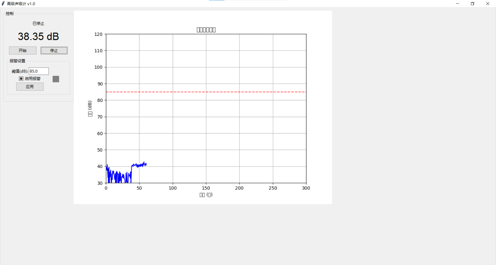

# 声级计python （声音大小）

✨ **详细介绍**：这个项目是用来测量声音大小。
---

## 🚀 快速开始（小白必看！）

### 第一项：安装
1. 下载代码（点击右上角绿色的 "Code" 按钮，选 "Download ZIP"）
2. 解压到你电脑的文件夹（比如桌面）
3.安装所需库:
   ```
   pip install pyaudio numpy matplotlib
   ```

### 第二项：运行
1. 双击打开 `声级计.py` 文件（Python项目）  
   *如果提示安装Python，先去[Python官网](https://www.python.org/)下载安装*

### 第三项：功能
1.  1. **完整的图形用户界面(GUI)**:
   - 使用Tkinter构建的专业界面
   - 实时数据显示和图形一体化
   - 响应式设计，可调整窗口大小

2. **报警功能**:
   - 可配置的报警阈值(30-120 dB)
   - 报警启用/禁用开关
   - 视觉报警指示器(红色/绿色)
   - 报警触发时弹出警告
   - 报警持续时间记录

3. **增强的图形功能**:
   - 实时更新的滚动图表
   - 报警阈值线(红色虚线)
   - 更好的坐标轴和网格显示

4. **改进的数据记录**:
   - 状态栏显示当前记录文件
   - 更稳定的数据写入机制
4. **4数据会自动保存到CSV文件**:
   
   

## 自定义选项

1. 修改`__init__`方法中的参数:
   - `record_interval`: 数据记录间隔(秒)
   - `max_records`: 图形中显示的最大数据点数
   - `alarm_threshold`: 默认报警阈值

2. 图形样式可以在`setup_plots`方法中调整

## 注意事项

1. 首次运行可能需要管理员权限访问麦克风
2. 报警弹出窗口可能会被其他窗口遮挡
3. 在资源有限的设备上，可以增加`record_interval`减少负载
4. 长时间运行会生成较大的CSV文件
---

## 📸 效果截图
（运行程序后会显示完整GUI界面:
   - 点击"开始"按钮启动声级计
   - 实时图表显示声级变化
   - 顶部显示当前dB值
   - 右侧可设置报警阈值）  
  

---

## ❓ 常见问题  
**问题1**：打不开怎么办？  
答：检查是否安装了Python，或者重启电脑试试  

**问题2**：怎么配置库？
答：win+r打开运行窗口cmd,在cmd窗口中输入  "   pip install pyaudio numpy matplotlib "

---

## 📞 联系我  
遇到问题？欢迎发邮件到：2983784475@qq.com
（或者加微信：）  